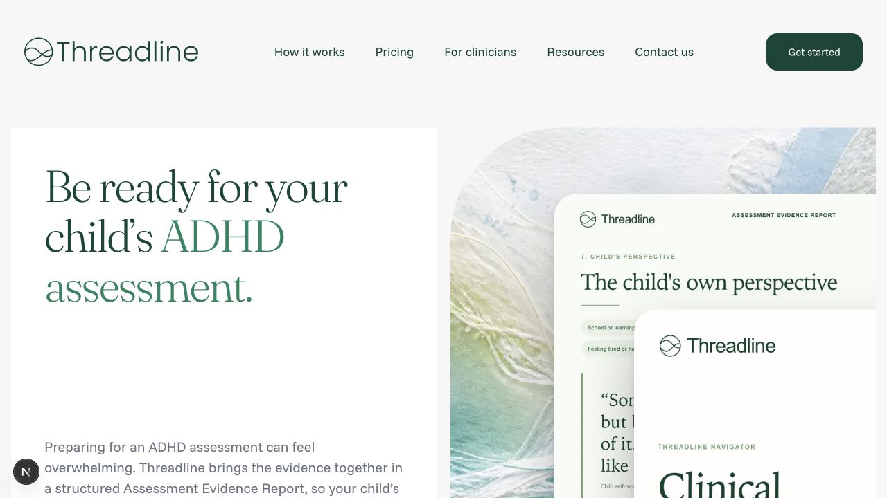
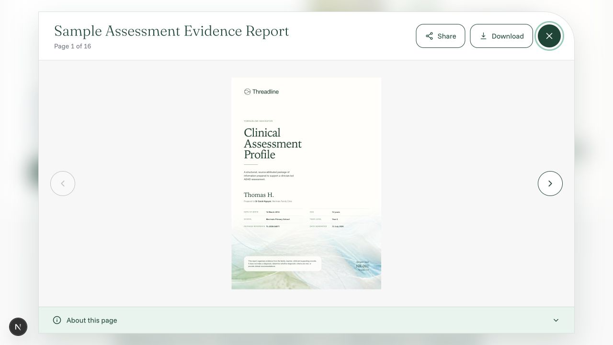
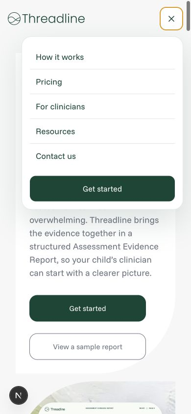
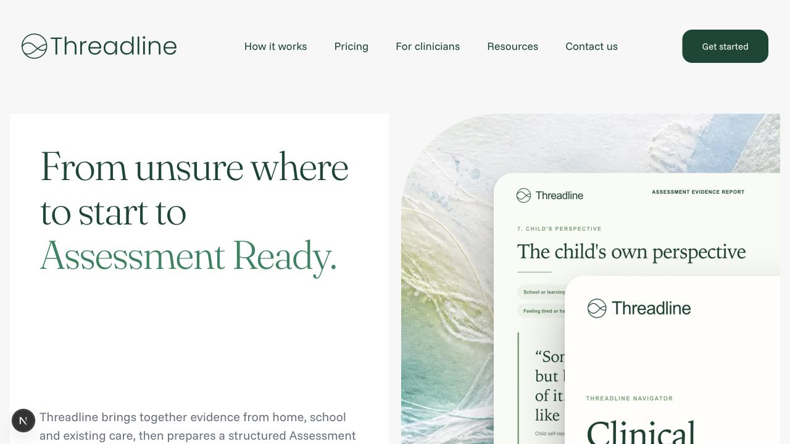
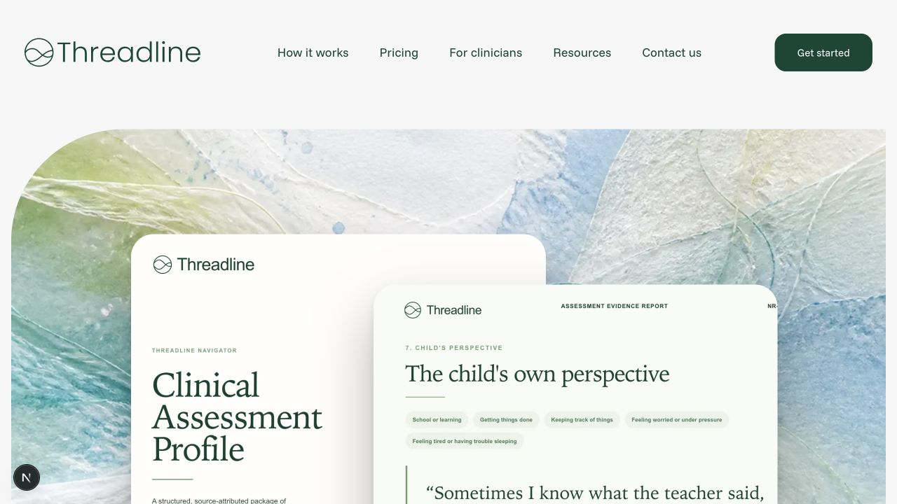

# Threadline code accessibility audit

Date: 2026-07-19  
Target: WCAG 2.2 Level AA  
Scope: public homepage, How It Works, Pricing, responsive navigation, FAQ disclosures, and the sample-report dialog/viewer.

## Overall verdict

The site has a sound semantic baseline: route-specific titles, one clear `h1` per route, labeled navigation, native links/buttons/disclosures, useful image alternatives, reduced-motion handling, and responsive layouts that reflow without horizontal overflow at 320 CSS pixels.

It is not ready for a WCAG 2.2 AA claim. Two shared color tokens fail contrast requirements, and the sample-report dialog does not contain focus or disable the page behind it. The most efficient remediation is to fix the shared focus/color tokens first, then harden the dialog and landmarks.

## Audit steps

1. **Homepage, desktop — generally healthy.** Strong heading/landmark structure and clear controls. Shared text and focus colors fail contrast.

   

2. **Sample-report viewer — needs work.** The dialog is named, receives initial focus, closes with Escape, restores trigger focus, and announces page numbers. However, 32 rendered page controls remain focusable outside the dialog because the background is neither inert nor included in a focus trap.

   

3. **Mobile navigation — generally healthy.** The menu and every link meet the tested minimum target size, and the 390px layout has no horizontal overflow. The control keeps the name “Open navigation menu” while expanded, which is a minor naming mismatch.

   

4. **How It Works — generally healthy.** One `h1`, a labeled main navigation, meaningful section headings, and no horizontal overflow. The global footer is rendered inside `main`, so it does not expose the expected page-level `contentinfo` landmark.

   

5. **Pricing — generally healthy.** Route-specific title, one `h1`, structured included-items list, and responsive reflow. It repeats the shared contrast, footer-landmark, and placeholder-link issues.

   

## Findings

### High — Focus indicators do not meet WCAG 2.2 contrast

`--ds-color-focus` is `#8acdb7`. Its contrast is 1.83:1 against white and 1.70:1 against the canvas, below the 3:1 minimum for focus appearance. The site applies this token as the custom outline for links, CTAs, report-viewer actions, and design-system buttons, replacing the browser's default indicator.

- WCAG: 2.4.11 Focus Appearance
- Code: `src/design-system/tokens.css:33`, `src/styles.css:103`, `src/styles.css:2224`
- Recommendation: use a focus treatment with at least 3:1 contrast against every adjacent surface; a two-color ring is the most robust option across white, canvas, and dark controls.

### High — The report dialog does not contain keyboard focus

Opening the viewer focuses the Close button, but the key handler only covers Escape and arrow-page navigation. The page behind the dialog remains interactive: the rendered state contained 6 focusable controls in the dialog and 32 outside it, with no `inert` or `aria-hidden` state on the page.

- WCAG: 2.4.3 Focus Order, 4.1.2 Name, Role, Value
- Code: `src/SampleReportModal.jsx:261`, `src/SampleReportModal.jsx:318`
- Recommendation: use a proven dialog primitive or add a focus loop, make non-dialog siblings inert for the dialog lifetime, preserve Escape/restore behavior, and test forward and reverse Tab order including the iframe.

### Medium — Repeated normal-size text misses 4.5:1 contrast

The accent token `#108560` has 4.29:1 contrast against the canvas and is used for 17.5px links and labels. Muted text `#6b7280` has 4.49:1 against the canvas and is used for 16.5px body/disclaimer copy. Both are below the 4.5:1 minimum for normal text.

- WCAG: 1.4.3 Contrast (Minimum)
- Code: `src/design-system/tokens.css:5`, `src/design-system/tokens.css:14`, `src/design-system/tokens.css:25`, `src/design-system/tokens.css:29`, `src/design-system/tokens.css:32`
- Recommendation: darken the semantic accent and muted-text roles on canvas, or introduce surface-specific tokens that guarantee at least 4.5:1.

### Medium — No bypass link for repeated navigation

Every route begins with the same navigation controls, but there is no visible-on-focus skip link to the main content. Keyboard and switch users must traverse the full header on each page.

- WCAG: 2.4.1 Bypass Blocks
- Code: `src/components/site-chrome.jsx:29`
- Recommendation: add a first-focusable “Skip to main content” link and a stable target on each `main` element.

### Medium — Global footers are nested inside `main` on two routes

The homepage correctly renders `SiteFooter` after `main`; How It Works and Pricing render it inside `main`. In the live accessibility snapshot, those footer contents were not exposed as the page-level `contentinfo` landmark.

- WCAG: 1.3.1 Info and Relationships
- Code: `src/HowItWorksPage.jsx:208`, `src/PricingPage.jsx:181`
- Recommendation: render the shared global footer as a sibling after `main` on every route.

### Medium — Footer link names promise destinations that do not exist

Instagram, LinkedIn, X, YouTube, Privacy Policy, and Terms of Service all link to `#top`. Their accessible names imply distinct destinations, but activating any of them only moves focus/scroll position to the page top.

- WCAG: 2.4.4 Link Purpose (In Context)
- Code: `src/components/site-chrome.jsx:14`, `src/components/site-chrome.jsx:62`, `src/components/site-chrome.jsx:100`
- Recommendation: supply real destinations, or render unavailable items as non-interactive text until routes exist.

### Low — A new-tab link is not announced, and the mobile menu name stays “Open” when expanded

The guideline link opens a new tab without visible or accessible advance notice. The mobile summary retains `aria-label="Open navigation menu"` in both states even though the visual icon changes to Close.

- Accessibility best practice; verify the mobile disclosure's state announcement with target screen readers.
- Code: `src/components/website-sections.jsx:79`, `src/components/site-chrome.jsx:41`
- Recommendation: add concise new-tab text (visually hidden if necessary), and derive the mobile menu's accessible name from its open state.

## Confirmed strengths

- `<html lang="en">` and route-specific document titles are present.
- Each audited route has one `main` and one clear `h1`; section heading order is coherent.
- Most decorative imagery uses empty alternatives, while report previews have descriptive alternatives.
- FAQ items use native `details`/`summary`; report actions use native links and buttons.
- The report viewer has a named modal role, initial focus, Escape close, trigger-focus restoration, disabled previous/next bounds, and a polite page-status announcement.
- `prefers-reduced-motion` is respected for reveal effects and design-system durations.
- Tested mobile navigation targets were 48–52px high; homepage and pricing had no clipped text or horizontal overflow at 320px.

## Evidence limits

This is a code and rendered-browser audit, not a certification. It did not include NVDA, JAWS, VoiceOver, TalkBack, Windows High Contrast/forced-colors, browser text-only zoom at 200–400%, cognitive usability sessions, or a production checkout/onboarding flow. The sample report iframe was inspected structurally, but its complete 16-page reading experience was not tested with a screen reader.
