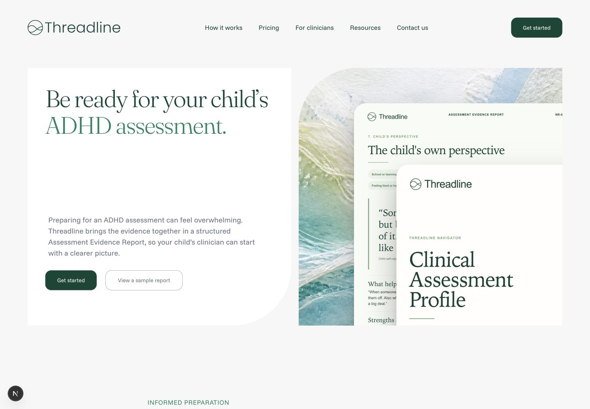
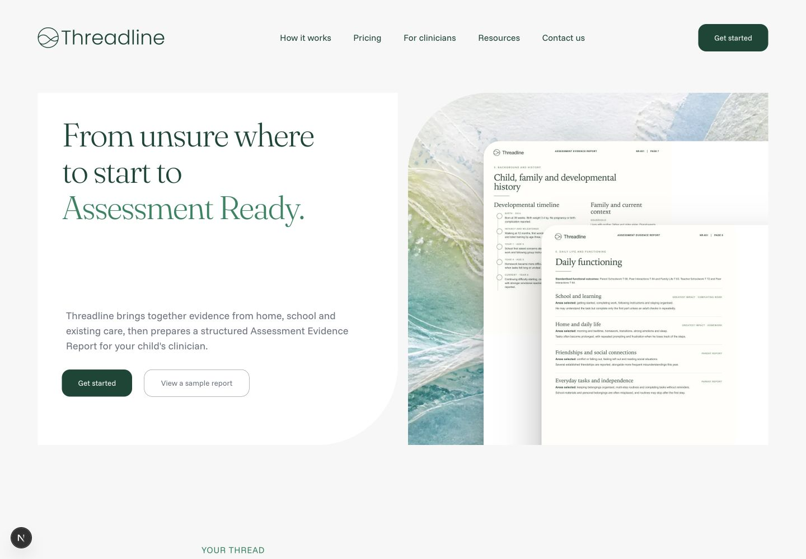
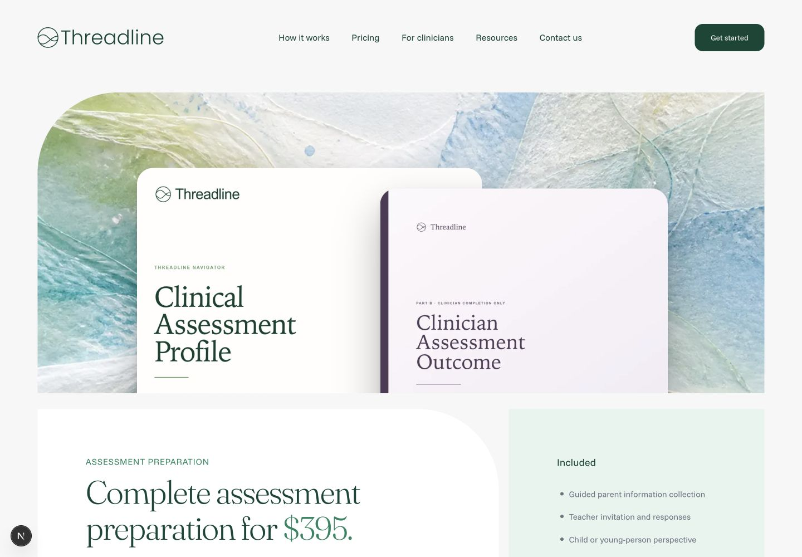
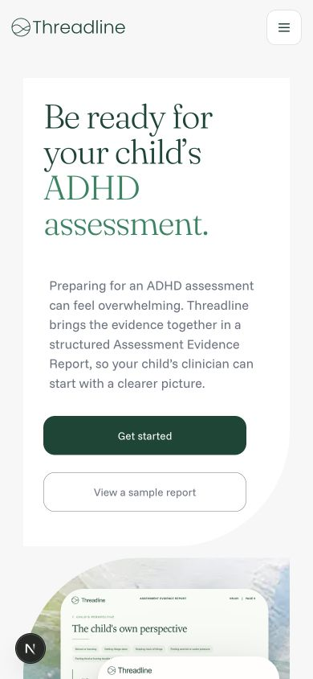
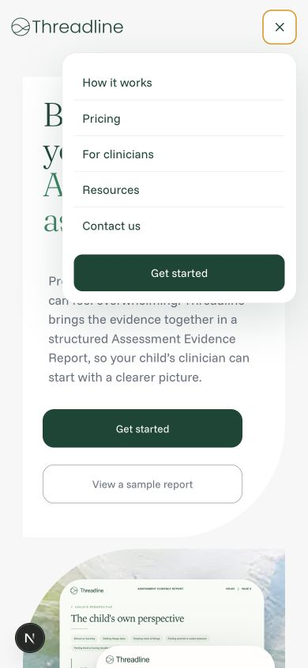
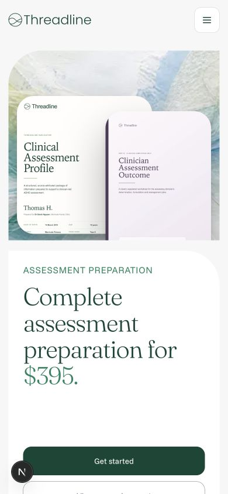
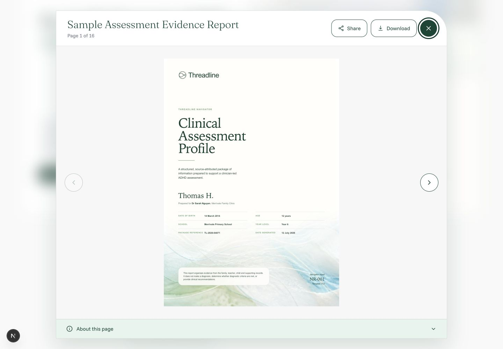
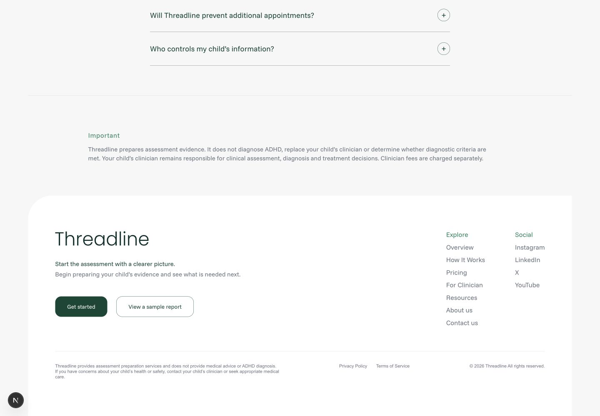

# Threadline code and UI consistency audit

Date: 19 July 2026

## Audit scope

Current working tree for the Home, How It Works, Pricing, sample-report modal, shared navigation/footer, and the local design system. The audit combined source inspection with rendered checks at 1440×1000 and 390×844. It did not change application code.

The production build passes. The main risk is not compilation; it is an append-only styling layer and parallel component conventions that make visual behavior depend on cascade order.

## Highest-priority findings

### 1. [P1] The global stylesheet contains several active generations of the same components

`src/styles.css` is 6,117 lines and contains 1,930 raw `px` occurrences spanning 290 distinct pixel values. The same selectors are redefined under successive Figma-restoration sections. For example, `.home-v2 .site-header` starts at lines 1370 and 3473, while `.home-v2 .home-v2-hero .hero-copy` appears at lines 1384, 3497, and again in the late spacing overrides at 5566.

Because How It Works renders with both `home-v2` and `how-v2`, homepage patches also style that page. In the current desktop capture, the How It Works header visually collapses to a single “P” even though the DOM and computed styles report the full navigation as visible. That mismatch needs a manual browser confirmation, but it is a strong signal that the current global cascade/compositing is fragile.

Recommendation: split the file into base chrome, shared section primitives, and route-scoped modules; remove superseded Figma patches after diffing computed styles; keep only intentional geometry as raw values.

### 2. [P1] The report modal has a hard-coded 16-page contract and an unbounded retry loop

`src/SampleReportModal.jsx:6` fixes `REPORT_PAGE_COUNT` at 16. At line 194 the viewer refuses to initialize unless the iframe contains exactly 16 `.page` elements, while line 356 starts a 100ms interval that only stops after initialization succeeds. A report with 15 or 17 pages would remain on “Loading report…” and poll for the lifetime of the open modal.

The component also injects a large CSS string into the iframe at line 200, including a literal `#fff`, pixel offsets, and A4 millimetre dimensions. This styling cannot use the normal token/component system.

Recommendation: derive page count from the loaded report, validate explanation metadata against it, show a bounded error state, and isolate the iframe-viewer stylesheet as a named asset.

### 3. [P1] Footer labels look interactive but several are non-interactive spans

The default social and legal items are plain strings in `src/components/site-chrome.jsx:14-15`. `FooterLink` renders strings as `` at line 63, so Instagram, LinkedIn, X, YouTube, Privacy Policy, and Terms of Service have no `href`. In the rendered footer they are styled alongside real links, creating a broken affordance and an accessibility mismatch.

Recommendation: require `{ label, href }` link objects for interactive columns, or render visibly non-interactive placeholder copy outside navigation groups.

### 4. [P2] Shared component APIs are routinely bypassed or replace their base class

`SiteCta` calls the design-system `Button` with `unstyled` (`src/components/site-chrome.jsx:19`), which opts out of `.ds-button` and recreates the control through `.cta`. The outline action repeats the same pattern through `.home-v2-outline-button`, which is patched in many route-specific selectors.

`SectionLabel` and `DisclosureList` use their default class only when no `className` is supplied (`src/components/website-sections.jsx:5,18`). Pricing passes `pricing-page-label` and `pricing-page-faq-list`, replacing rather than extending the base classes. The result is a second label/FAQ implementation with many duplicated selectors around `src/styles.css:5141` and `src/styles.css:5986-6037`.

Recommendation: merge base and supplied classes, express CTA/outline variants through `Button`, and choose one production navigation/footer layer rather than maintaining both `SiteNavigation`/`SiteFooter` and the design-system `TopNavigation`/`Footer` contracts.

### 5. [P2] A global CSS `zoom: 0.9` scales the entire product

`src/styles.css:2` defines `--site-scale: 0.9`, and `.page-shell` applies `zoom` at line 38. This compounds user/browser zoom, makes computed CSS sizes differ from visible sizes, and can create inconsistent breakpoint, focus-ring, and screenshot behavior. The rendered 54px CTA, for example, measures 49px after the global scale.

Recommendation: remove global `zoom` and encode the intended layout dimensions directly through tokens and responsive rules.

### 6. [P2] The mobile navigation’s visible state and accessible name diverge

The summary always has `aria-label="Open navigation menu"` in `src/components/site-chrome.jsx:42`, but its icon changes to a close symbol while open. The open-state capture also shows the brand cropped on the left. The document itself does not overflow, so this should be verified in a second browser, but the visual state is not acceptable as captured.

Recommendation: use a stateful menu button with `aria-expanded`, swap its accessible name to “Close navigation menu,” and keep the logo in a non-shrinking grid/flex track.

### 7. [P2] A visual list is not represented as a semantic list

`ProblemSection` maps pain points to `
` elements inside an `<article>` (`src/components/website-sections.jsx:97-101`). These are clearly rendered as a list of four parallel items, but assistive technology receives unrelated paragraphs. This is inconsistent with the design-system reference, which explicitly standardizes content lists on `<ul>` and `<li>`.

Recommendation: render a native list and keep the existing card layout through CSS.

### 8. [P3] Shared content is duplicated across routes

The seven-item pricing inclusion list exists independently as `PRICING_ITEMS` in `src/App.jsx` and `INCLUDED_ITEMS` in `src/PricingPage.jsx`. The strings currently match exactly, but future edits can easily drift.

Recommendation: move the canonical list into `src/content/site-content.js` and import it in both compositions.

## Rendered flow

1. **Home, desktop — healthy.** Shared header, hero actions, and report artwork render coherently.

2. **How It Works, desktop — needs attention.** The hero renders, but the shared header is visually missing except for a single character in this capture.

3. **Pricing, desktop — healthy.** The page keeps the same visual language and card geometry.

4. **Home, mobile — healthy.** The hero reflows without horizontal document overflow.

5. **Mobile menu — needs attention.** Menu content and CTA are clear, but the brand is clipped and the accessible label still says “Open.”

6. **Pricing, mobile — mostly healthy.** Content reflows and the headline remains legible; fixed artwork extends outside its panel but is clipped by the page shell.

7. **Sample report modal — visually healthy, structurally brittle.** Focusable controls, page status, and explanation affordance are clear; the hard-coded page contract is the implementation risk.

8. **Footer — needs attention.** Layout is coherent, but social and legal labels are visually presented like links without link behavior.

## Evidence limits

The visual checks were run in the Codex in-app browser. The How It Works header and open-menu logo anomalies should be confirmed in Chrome/Safari before treating them as cross-browser defects. Screenshots support visual and structural findings, not full WCAG conformance. Keyboard order, screen-reader announcements, contrast ratios, and zoom/reflow above 100% still need dedicated testing.

## Verification

- `npm run build`: passed with Next.js 16.2.10.
- Routes rendered: `/`, `/how-it-works`, `/pricing`.
- Interaction checks: mobile menu, report modal, footer navigation target.
